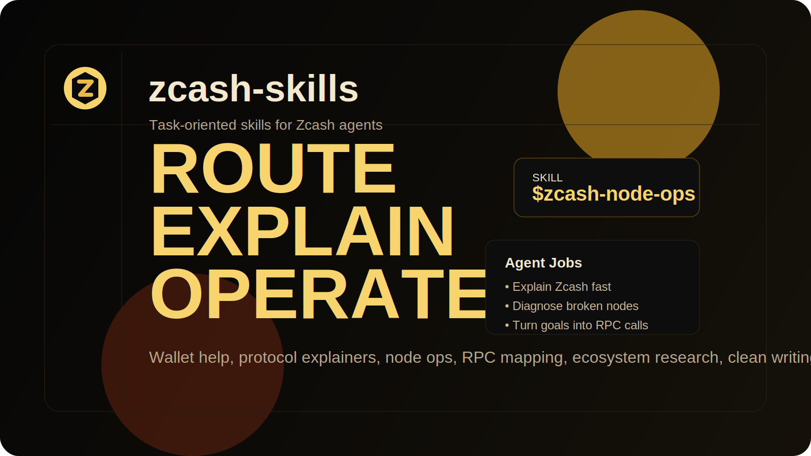
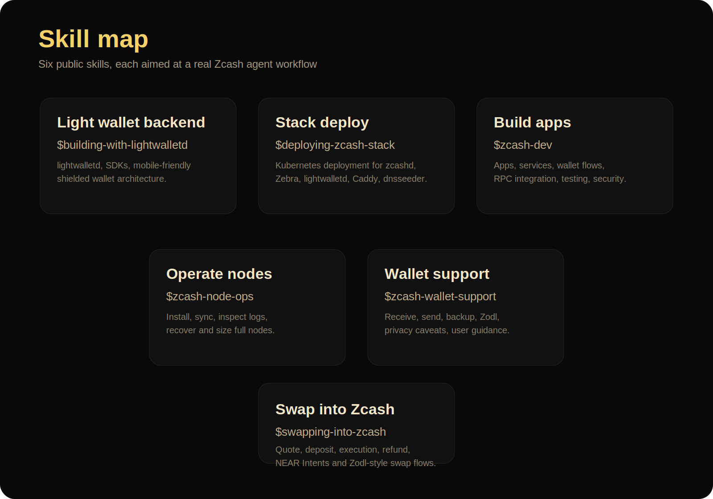
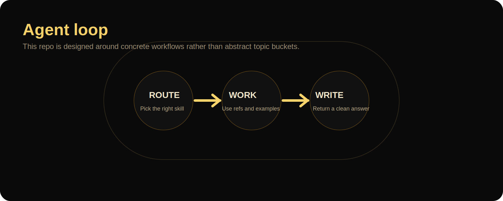

# zcash-skills

Focused public skill pack for agents working on real Zcash jobs.

The catalog is intentionally small. It keeps only the skills an agent is most likely to reach for in practice:

- build Zcash apps and integrations
- operate and debug Zcash nodes
- help users with wallets, receiving, sending, and privacy tradeoffs

The reference data in these skills is grounded in:

- official Zcash docs and the `zcashd` book
- the Zebra book and RPC docs
- `zcash/zcash`, `zcash/lightwalletd`, and the wallet SDK repos
- current wallet-product material from Zodl where it changes user-facing guidance



## Why this repo exists

Most skill repos look clean at the top level but get fuzzy once an agent actually opens a skill. This repo is opinionated in the other direction:

- each skill is action-oriented
- each skill has example prompts
- each skill has routing guidance
- detailed material lives in `references/`
- UI metadata exists in `agents/openai.yaml`

The structure is Codex-native first, but the presentation is meant to feel like a polished public skills catalog.

## What agents can do with it

| Skill | Agent job |
| --- | --- |
| `building-with-lightwalletd` | Build and debug light-wallet backends and SDK integrations |
| `deploying-zcash-stack` | Deploy Kubernetes-based multi-service Zcash infrastructure |
| `zcash-dev` | Build Zcash apps, services, wallet flows, RPC integrations, and developer tooling |
| `zcash-node-ops` | Diagnose node install, sync, config, and runtime issues |
| `zcash-wallet-support` | Help users choose wallets, receive, send, back up, and avoid privacy mistakes |



## Layout

```text
zcash-skills/
├── README.md
├── assets/
├── examples/
└── skills/
    ├── building-with-lightwalletd/
    ├── deploying-zcash-stack/
    ├── zcash-dev/
    ├── zcash-node-ops/
    └── zcash-wallet-support/
```

## Quick start

Copy or install the skill folders into a Codex-discoverable skills directory, then call them explicitly or let the harness trigger them from their frontmatter descriptions.

Examples:

```text
Use $building-with-lightwalletd to set up a shielded light-wallet backend for mobile apps.
Use $deploying-zcash-stack to plan a Kubernetes deployment of the Zcash ecosystem.
Use $zcash-dev to help design this Zcash wallet or RPC integration.
Use $zcash-wallet-support to help me receive ZEC with better privacy.
Use $zcash-node-ops to debug why my node is stuck syncing.
```

See [quick-prompts.md](/Users/gauthamsanthosh/Polynomial/zcash/zcash-skills/examples/quick-prompts.md) for more example invocations.

## Design rules

- Keep `SKILL.md` short enough to load fast.
- Move detail to `references/`.
- Write descriptions as trigger logic, not marketing copy.
- Prefer task language over abstract topic language.
- Keep the catalog tight and developer-heavy.
- Keep privacy, wallet, and ops guidance explicit about tradeoffs.

## Notes

- This repo does not try to be a giant topic index.
- It is meant to feel closer to the tighter public skill repos you pointed at: fewer skills, stronger workflows, less filler.
- The content is structured so another agent can use it immediately without guessing what the skill is for.


